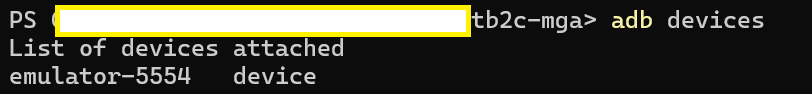
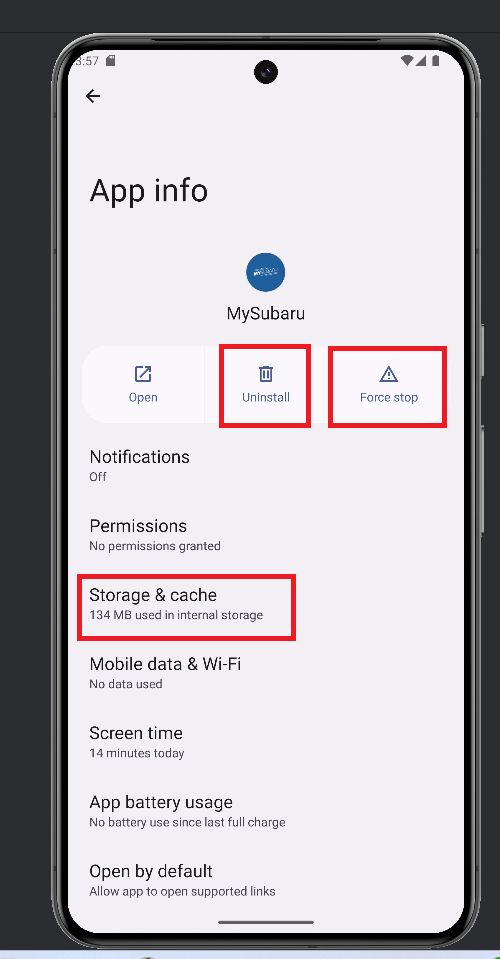

# MySubaru React Native Setup Guide for Windows with Android Studio

## Purpose

This guide is for running the MySubaru MGA React Native App on android
emulator on a Windows.

## Environment

Window 11, JDK 17, Android Studio iguana, npm/npx 10

These are general recommendations that work for me.

Once download/install completed, configure the environment variables as
below

- ANDROID_HOME: "..\\AppData\\Local\\Android\\SDK"

- JAVE_HOME: "..\\jdk-17"

- npm in Environment path: "..\\AppData\\Roaming\\npm"

## Running the code

Download source code from git:
https://github.com/SubaruOfAmerica/tb2c-mga.git

### Setting up an Android Emulator

Next, configure "SDK platforms" in Android studio's IDE settings. The
target production environment to support is Android version 13.0 and SDK
platform version 33. They can be downloaded and installed from here.

Afterwards, you should have below selected

Please note under "SDK Tools" tab, you could have different SDK platform tool and emulator versions. 
They are only used in development process,
and higher versions are better.

Next, create an emulator from the device manager. Here I am using Pixel
8 pro.

In the next step, select system image version to match the target
production environment - Tiramisu (android 11) with API level 33.

Use default options in the next step and create a virtual device. Then
power up.

When the emulator is on, it should be listed in the adb devices in
PowerShell

In case of experiencing "The system UI isn\'t responding" upon power up.
You can edit the emulator in Device Manager. Under the Advanced Setting,
change Emulated Performance -- Boot option to "Cold Boot". Using Cold
boot takes slightly longer to boot emulator device, but it can restore
the device to clean state. This option can be useful as well when there
are major code changes in MySubaru App.

### Running MySubaru App

In a Powershell Terminal run the below commands at the project root

Step 1. Install package.json node modules

    npm install

or if you have made changes in package.json

    npm ci

Step 2. Retrieve project package.json version and set it as a global object in
PowerShell

    $packageJson = Get-Content -Path ".\package.json" | ConvertFrom-Json
    $env:npm_package_version = $packageJson.version

Initialize source JavaScript files with node.js

    Get-ChildItem src\scripts\*.js | Foreach-Object { node $_ }

Step 3. Run the App with **Metro**

    npx react-native start

Sometimes, after making changes in package.json, you can get a cleaner
start with

    npx react-native start --reset-cache

Most of the time, you only need to run step 3.

After **Metro** menu appears, press "a" for "a -- run on Android" to
**install** the APP to the emulator.

It will take a few minutes or more to build the android code and install
apk to the device. When it finishes, it should automatically launch the
MySubaru app on the emulator, as below.

The app only needs to be installed once on a new device. After the first
time, the next time you can just launch the MySubaru app on the device,
then select "r -- reload the app" from the **Metro** menu to refresh it
with latest changes. Also, with the react server running, it listens to
live changes to the code and does hot refresh to the app on device.

If the "r - reload the app" option complains having no device connected,
or your code change doesn't trigger a hot refresh, run the below command
to enable the communication between emulator and react server at the
project root -

    adb reverse tcp:8081 tcp:8081

By default, react server and emulator should be able to communicate on
port 8081 but it may be disconnected after a while.

In case the app is crash or stuck, or receives major code changes, you
can clear its cache/storage, force stop, or uninstall it from the device
app settings.

